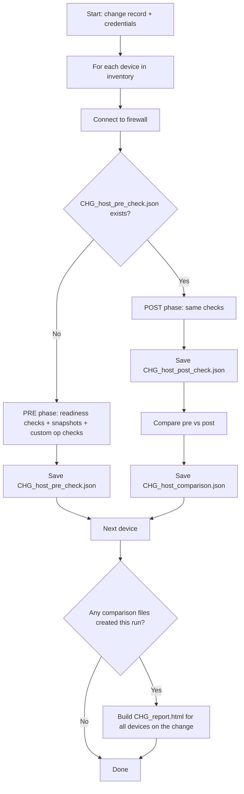

# PAN-OS Upgrade Change Assurance

Tools for checking Palo Alto Networks firewalls before and after a PAN-OS upgrade, comparing the two states, and producing an HTML report per change record.

| File | Purpose |
|---|---|
| [`pre_post_checks_html.py`](pre_post_checks_html.py) | Connects to each firewall, runs readiness checks and state snapshots, saves them as JSON, and on the second run compares pre vs. post. |
| [`generate_html_report.py`](generate_html_report.py) | Reads the JSON files and builds one combined HTML report per change record. Called automatically by the check script after a post-check run; can also be run on its own. |

---

## Contents

1. [Requirements](#requirements)
2. [How it works](#how-it-works)
3. [Running the checks](#running-the-checks)
4. [Output files](#output-files)
5. [Configuration](#configuration)
6. [HTML report](#html-report)
7. [Troubleshooting](#troubleshooting)
8. [Exit codes](#exit-codes)

---

## Requirements

- Python 3.8+ (developed and tested on 3.13)
- [`pan-os-python`](https://pypi.org/project/pan-os-python/)
- [`panos-upgrade-assurance`](https://pypi.org/project/panos-upgrade-assurance/)
- API access to each firewall with an account that can run operational commands

```bat
python -m venv .venv
.venv\Scripts\activate
pip install pan-os-python panos-upgrade-assurance
```

`generate_html_report.py` uses only the Python standard library. It must sit in the **same folder** as the check script for the automatic report to work.

---

## How it works

The same command is run twice for a change: once before the upgrade and once after. The script decides which phase to run for each device by looking for that device's pre-check file.



What is collected in each phase:

| Part | Source | Behaviour on failure |
|---|---|---|
| **Readiness checks** | `CheckFirewall.run_readiness_checks()`, one check at a time | A check that raises an exception is recorded as `ERROR` for that check only; the others still run. |
| **State snapshots** | `CheckFirewall.run_snapshots()` | An area that cannot be captured is saved with `"snapshot": null` and a `reason`. |
| **Custom op checks** | `fw.op(<command>)` for each entry in `CUSTOM_OP_CHECKS` | A failing command is saved as `{"error": "..."}` for that entry only. |

During the post phase the comparison is made up of:

- **Snapshot comparison:** `SnapshotCompare` on every snapshot area that has data on **both** sides. Areas with no data on either side are skipped and listed in a log warning (and shown as `SKIPPED` in the HTML report).
- **Readiness check comparison:** a shallow diff of the pre and post readiness results (`changed` / `added` / `removed`).
- **Custom check comparison:** a shallow diff of the custom op-command output.

A short summary of each device's comparison is printed to the console.

---

## Running the checks

```bat
:: Uses devices.csv in the current folder, or STATIC_INVENTORY if there is no CSV
python pre_post_checks_html.py --change-record CHG0012345

:: Single device
python pre_post_checks_html.py --change-record CHG0012345 --host 10.0.0.1

:: Specific inventory file
python pre_post_checks_html.py --change-record CHG0012345 --inventory-file my_devices.csv

:: Post-check run with a dark-theme report
python pre_post_checks_html.py --change-record CHG0012345 --report-theme dark

:: Post-check run without building the HTML report
python pre_post_checks_html.py --change-record CHG0012345 --no-html-report
```

### Command-line options

| Option | Description |
|---|---|
| `--change-record CR_NUMBER` | Change record number used as the first part of every output filename. If omitted you are prompted for it. Must not be empty or contain `/ \ : * ? " < > \|`. |
| `--host HOST` | Process a single device. Overrides any inventory file. |
| `--inventory-file PATH` | CSV file listing devices. |
| `--no-html-report` | Don't build the combined HTML report after post-checks. |
| `--report-theme {auto,light,dark}` | Starting theme of the generated report (default `auto`, which follows the viewer's OS setting). |

### Credentials

You are prompted for a username and password at the start of each run (the password is hidden). The same credentials are used for every device in the run. They are not saved anywhere.

### Inventory

Devices are taken from the first of these that applies:

1. `--host`
2. `--inventory-file`
3. `devices.csv` in the current folder
4. `STATIC_INVENTORY` in the script

The CSV can be a single column with no header, or have a header. With a header, the first column named `host`, `hostname`, `ip`, `device` or `address` is used:

```csv
host
fw1.example.com
10.0.0.1
```

### Typical change workflow

1. **Before the upgrade:** run the script with the change record. Each device gets a `*_pre_check.json`.
2. Review the pre-check results (optionally build a pre-check-only report with `python generate_html_report.py CHG0012345`) and fix anything that would block the upgrade.
3. Perform the upgrade.
4. **After the upgrade:** run the script again with the **same change record, from the same folder**. Each device with a pre-check file gets a `*_post_check.json` and `*_comparison.json`, and `CHG0012345_report.html` is built.
5. Review the report.

> To repeat a pre-check for a device, delete (or move) its `*_pre_check.json` first. Otherwise the next run is treated as a post-check.

---

## Output files

All files are written to the **current working directory**.

| File | Created by | Contents |
|---|---|---|
| `<CHG>_<host>_pre_check.json` | Pre phase | `metadata`, `readiness_checks`, `state_snapshot`, `custom_checks` |
| `<CHG>_<host>_post_check.json` | Post phase | Same structure as the pre-check |
| `<CHG>_<host>_comparison.json` | Post phase | `timestamp`, `ignored_keys`, `native_snapshot_comparison`, `readiness_check_comparison`, `custom_check_comparison` |
| `<CHG>_report.html` | End of a post-check run, or `generate_html_report.py` | Combined report for every device on the change record |

`<host>` is the hostname reported by the firewall, or the address from the inventory if the firewall doesn't report one.

Example readiness check result:

```json
"free_disk_space": {
    "state": false,
    "status": "FAIL",
    "reason": "There is not enough free space, only 2.5GB is available."
}
```

Example snapshot area that couldn't be captured:

```json
"routes": {
    "state": false,
    "status": "ERROR",
    "reason": "Failed to retrieve routes information: Command deprecated in Advanced Routing Mode.",
    "snapshot": null
}
```

---

## Configuration

All configuration is in the constants near the top of the check script.

### `READINESS_CHECKS_CONFIG`

Readiness checks from `panos-upgrade-assurance`. Currently enabled:

| Check | What it verifies |
|---|---|
| `ha` | HA state and configuration (returns `ERROR` on a standalone firewall) |
| `free_disk_space` | Enough free disk space for the upgrade image |
| `mp_cpu_utilization` | Management-plane CPU usage |
| `dp_cpu_utilization` | Dataplane CPU usage |
| `candidate_config` | No uncommitted changes on the device |
| `panorama` | Panorama connectivity |

Also available but commented out: `session_exist`, `ip_sec_tunnel_status`, `arp_entry_exist`. Options for a check go in its dict, e.g. `{"free_disk_space": {"image_version": "11.1.4"}}`. See the [panos-upgrade-assurance readiness check docs](https://pan.dev/panos/docs/panos-upgrade-assurance/configuration-details/#readiness-checks) for each check's options.

### `SNAPSHOT_STATE_AREAS`

State captured on each run and compared in the post phase:

| Area | Contents |
|---|---|
| `nics` | Interface up/down state |
| `routes` | Routing table (legacy routing engine) |
| `are_routes` | Routing table (Advanced Routing Engine) |
| `fib_routes` | Forwarding table (legacy routing engine) |
| `are_fib_routes` | Forwarding table (Advanced Routing Engine) |
| `arp_table` | ARP entries |
| `session_stats` | Session counts and rates |
| `ip_sec_tunnels` | IPSec tunnel state |
| `bgp_peers` | BGP peers (legacy routing engine) |
| `license` | Installed licences |
| `content_version` | Installed content version |
| `mtu` | Interface MTUs (including subinterfaces) |

The legacy areas (`routes`, `fib_routes`, `bgp_peers`) fail on firewalls running Advanced Routing, and the `are_*` areas are for those firewalls. Failed areas are skipped in the comparison, so it's safe to leave both sets enabled for a mixed estate.

A dict entry passes options to the **capture** step only, e.g. `{"mtu": {"include_subinterfaces": True}}`. Comparison options go in the two settings below.

### `SNAPSHOT_REPORT_CONFIG`

Comparison options for each area:

| Key | Applies to | Meaning |
|---|---|---|
| `count_change_threshold` | Most areas | Fail if more than this percentage of entries were added or removed. |
| `properties` | Most areas | Keys to include or exclude (`"!key"` excludes). If you list any key **without** `!`, only the listed keys are compared. |
| `thresholds` | `session_stats` only | Allowed percentage change per metric, e.g. `[{"num-active": 10}]`. **Without this, `session_stats` comparison returns no result.** |

Current settings:

```python
SNAPSHOT_REPORT_CONFIG = {
    "routes":        {"count_change_threshold": 5},
    "session_stats": {"thresholds": [{"num-active": 10}, {"num-tcp": 10}, {"cps": 10}]},
    "arp_table":     {"count_change_threshold": 10},
    "are_routes":    {"count_change_threshold": 5},
}
```

### `SNAPSHOT_IGNORE_KEYS`

Keys to ignore in the comparison for each area, so values that always change between runs don't cause failures. Each key is added to that area's `properties` as `"!key"` and matches at any depth. For `session_stats`, listed metrics are removed from `thresholds` instead.

| Area | Ignored keys | Why |
|---|---|---|
| `routes`, `fib_routes`, `are_fib_routes` | `age` | Counts up continuously |
| `are_routes` | `uptime` | Counts up continuously |
| `arp_table` | `ttl`, `port` | TTL counts down; port can be relearned |
| `bgp_peers` | `status-duration`, `last-error` | Change on every session reset |
| `license` | `expires`, `expired` | Not relevant to the upgrade |

The ignored keys are recorded in each `*_comparison.json` and shown in the HTML report.

### `READINESS_IGNORE_KEYS` / `CUSTOM_CHECK_IGNORE_KEYS`

Top-level names to leave out of the readiness and custom-check diffs, e.g. `"candidate_config"`. Both are empty by default.

### `CUSTOM_OP_CHECKS`

Extra operational commands whose raw XML output is saved and diffed between runs, as `name: command`. All entries are currently commented out. The examples in the script use legacy routing commands; on Advanced Routing firewalls use the `show advanced-routing ...` equivalents, for example:

```python
CUSTOM_OP_CHECKS = {
    "ha_state":         "show high-availability state",
    "are_bgp_peers":    "show advanced-routing bgp peer status",
    "system_resources": "show system resources",
}
```

The diff compares the full output text. Output containing counters or timers will always show as changed, so these checks are most useful for output that should stay stable.

---

## HTML report

The check script builds `<CHG>_report.html` automatically at the end of any run that created at least one comparison file. It is built once per run and includes **every device on the change record** found in the folder, including devices checked in earlier runs.

### Running it manually

```bat
:: One report per change record found in the current folder
python generate_html_report.py

:: All devices for one change record
python generate_html_report.py CHG0012345

:: Several change records (one report each)
python generate_html_report.py CHG0012345 CHG0067890

:: A single device
python generate_html_report.py CHG0012345_fw1.example.com

:: Different folder, output name and theme
python generate_html_report.py CHG0012345 --dir .\output -o CHG0012345.html --theme dark

:: Explicit files for one device
python generate_html_report.py --pre a.json --post b.json --comparison c.json -o out.html
```

| Option | Description |
|---|---|
| `CHANGE_RECORD ...` | A change record (all its devices) or a full `<CHG>_<host>` prefix (one device). If omitted, every change record in the folder gets a report. |
| `--dir PATH` | Folder containing the JSON files (default: current folder). Reports are written here. |
| `-o, --output PATH` | Output file. Only used when a single report is produced. |
| `--theme {auto,light,dark}` | Starting theme (default `auto`). |
| `--pre / --post / --comparison` | Explicit file paths for a single device. |

Files are found by `<CHG>_*_pre_check.json`; the post-check and comparison files are optional, so a report can be built after the pre-check alone. The change record is taken as the text before the first `_` in the filename, so **change record numbers must not contain underscores**.

### What the report shows

- **Header:** change record, number of devices, devices with issues, post-checks completed (e.g. `2/3`), overall status and the time the report was generated.
- **Summary cards:** devices by overall status, and pass/fail counts for each section across all devices.
- **Device overview table:** one row per device with its overall status, each section's status, and pre/post-check times. Click a device to jump to its details.
- **One expandable section per device:**
  - **Readiness checks:** pre and post status side by side, flagged when the status changed; expand for the reason from each run.
  - **Snapshot capture:** whether each area was captured on each run and how many entries it has; expand for the failure reason and raw data.
  - **Snapshot comparison:** a failed area expands straight down to a table of changed values (pre vs. post), along with added/missing entries and percentage thresholds. Areas that couldn't be compared show as `SKIPPED` with the reason from each side.
  - **Custom op checks:** errors, whether output changed, and the raw output.
  - **Ignored keys** and any **file load errors** (a JSON file that won't load is reported here; other devices still appear).
- **Toolbar:** expand devices / expand everything / collapse all, *Show only issues*, a hostname filter, and a theme selector (System, Light, Dark). The selected theme is remembered by the browser.

Status meanings:

| Badge | Meaning |
|---|---|
| `PASS` | Check passed, or no differences found |
| `FAIL` | Check failed, or differences found |
| `ERROR` | Check couldn't run, or a file couldn't be loaded |
| `SKIPPED` | Not compared because data was missing on one or both sides |
| `N/A` | Not evaluated (e.g. `session_stats` without thresholds) |

All times are shown as `YYYY-MM-DD HH:MM:SS (UTC±HH:MM)` in the time zone of the machine that generated the report.

The report is a single HTML file with no external dependencies, so it can be attached to the change record as-is.

---

## Troubleshooting

| Symptom | Cause | Fix |
|---|---|---|
| `routes`, `fib_routes` or `bgp_peers` show `ERROR` with *"Command deprecated in Advanced Routing Mode"* | The firewall runs Advanced Routing; these areas use legacy commands. | Expected. They're skipped in the comparison. Use `are_routes` / `are_fib_routes`, and `show advanced-routing ...` commands for BGP in `CUSTOM_OP_CHECKS`. |
| `panorama` shows `ERROR` with *"Cloud management is enabled for this firewall"* | The firewall is cloud-managed rather than Panorama-managed. | Expected for these firewalls; other checks are unaffected. Remove `{"panorama": {}}` from `READINESS_CHECKS_CONFIG` if not needed. |
| `ha` shows `ERROR` with *"Device is not a member of an HA pair"* | Standalone firewall. | Expected; remove `{"ha": {}}` if no firewalls are in HA. |
| `are_routes` fails with only `uptime` changes | Route uptime changes between runs. | `uptime` is already in `SNAPSHOT_IGNORE_KEYS["are_routes"]`; add similar keys for other areas if needed. |
| `session_stats` shows `N/A` | No `thresholds` configured. | Add `thresholds` for `session_stats` in `SNAPSHOT_REPORT_CONFIG`. |
| Second run did a pre-check instead of a post-check | The pre-check file wasn't found: different folder, different change record, or the firewall reported a different hostname. | Run from the same folder with the same change record. Check the filename prefix in the log. |
| HTML report wasn't created | Pre-check-only run, `--no-html-report` was used, or `generate_html_report.py` isn't next to the check script. | Check the log for *"HTML report skipped"*, or run `python generate_html_report.py <CHG>` manually. |
| Device missing from the report | Its pre-check file is in another folder or under another change record. | Move the files into the same folder, or use `--dir`. |

The check script writes its log to the console (stderr). To keep a copy, redirect only stderr so the username and password prompts stay visible:

```bat
python 04220012_2026-10-01_pre_post_checks_v2.py --change-record CHG0012345 2> CHG0012345_run.log
```

The log then goes only to the file, not the screen.

---

## Exit codes

**Check script**

| Code | Meaning |
|---|---|
| `0` | All devices processed successfully |
| `1` | Setup problem: invalid change record, no inventory, missing inventory file, or missing credentials |
| `2` | One or more devices failed (connection, authentication or unexpected error). Other devices are still processed and the report is still built. |

Readiness check failures and comparison differences do **not** change the exit code; review the report for those.

**Report generator**

| Code | Meaning |
|---|---|
| `0` | All reports built and all files loaded |
| `1` | No matching files found, a file failed to load (the report is still written), or a report couldn't be written |
